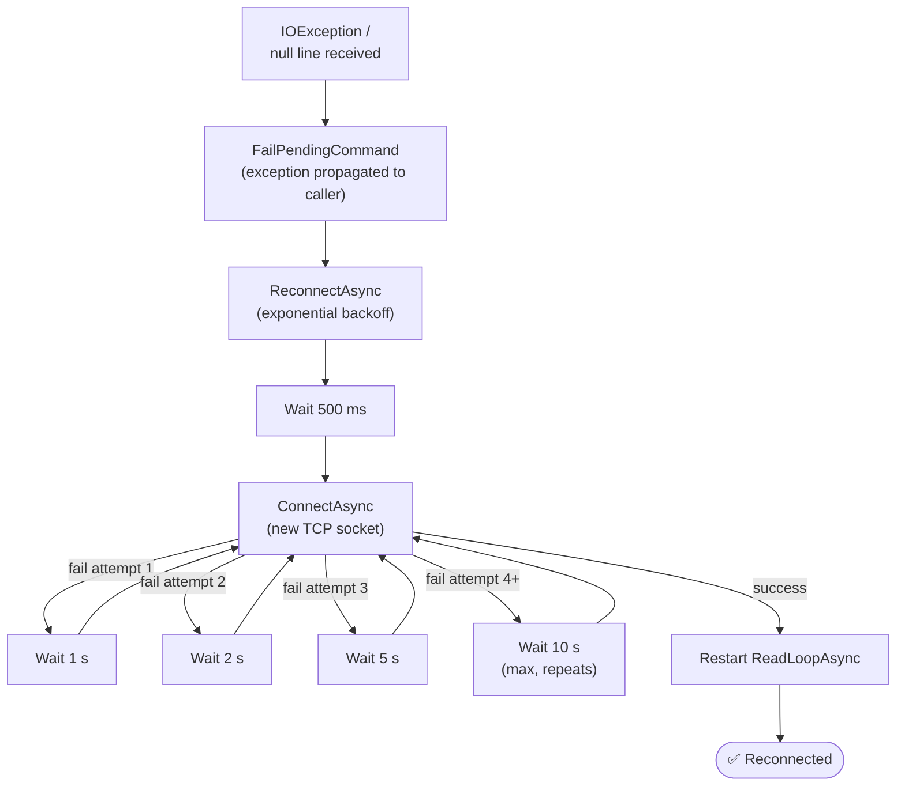
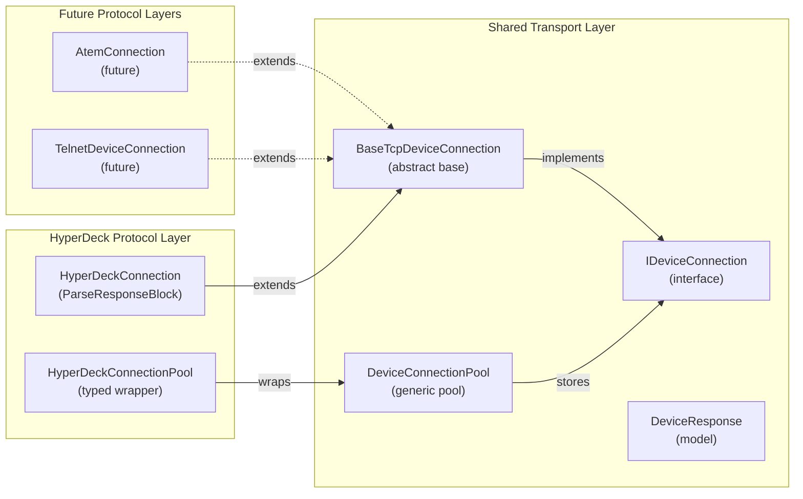

# TCP Device Framework — Command Flow Diagram

## User-to-Result Flow

The following Mermaid diagram traces the complete path from a user triggering
a command in the ProdControlAV web UI to receiving the execution result.

```mermaid
flowchart TD
    User(["👤 User"])
    WebUI["Blazor WebApp\n(browser)"]
    API["ASP.NET Core API\n/api/agents/commands/…"]
    DB[("Azure SQL DB\nCommandQueue")]
    Agent["Agent Worker\n(Raspberry Pi)"]
    Poll["CommandService\n.PollCommandsAsync()"]
    Router["CommandService\n.ExecuteCommandAsync()"]
    Pool["DeviceConnectionPool\n.GetOrCreateAsync()"]
    Base["BaseTcpDeviceConnection\n.SendCommandCoreAsync()"]
    Device["🎬 AV Device\n(HyperDeck / ATEM / …)"]
    Parser["HyperDeckConnection\n.ParseResponseBlock()"]
    Response["DeviceResponse\n{ Success, StatusCode,\n  Message, Data }"]
    History["CommandService\n.RecordCommandHistoryAsync()"]
    ResultDB[("Azure SQL DB\nCommandHistory")]
    ResultAPI["API Response\n(200 OK with result)"]
    ResultUI["Result displayed\nin Web UI"]

    User -->|"Click action button"| WebUI
    WebUI -->|"POST /api/commands"| API
    API -->|"Enqueue command payload"| DB

    Agent -->|"PeriodicTimer every N seconds"| Poll
    Poll -->|"POST /api/agents/commands/poll\n(JWT-authenticated)"| API
    API -->|"Dequeue next command"| DB
    API -->|"Return CommandPayload"| Poll

    Poll -->|"CommandPayload"| Router
    Router -->|"Route by CommandType\n(HYPERDECK / ATEM / …)"| Pool

    Pool -->|"GetOrCreateAsync\n(deviceType:host:port)"| Base
    Base -->|"StartAsync if new\n(TCP connect)"| Device

    Router -->|"SendCommandAsync\n(command text)"| Base

    subgraph TCP Transport ["BaseTcpDeviceConnection  (shared infrastructure)"]
        direction TB
        Lock["SemaphoreSlim\n(one command in flight)"]
        Channel["Channel&lt;OutboundCommand&gt;\n(write queue)"]
        WriteLoop["WriteLoop\n(sends formatted cmd)"]
        ReadLoop["ReadLoop\n(buffers response lines)"]
        TCS["TaskCompletionSource\n&lt;DeviceResponse&gt;"]

        Lock --> Channel --> WriteLoop
        WriteLoop -->|"CRLF-terminated ASCII"| ReadLoop
        ReadLoop -->|"blank line = end of block"| TCS
    end

    Base --- TCP Transport
    WriteLoop -->|"TCP stream write"| Device
    Device -->|"TCP stream read"| ReadLoop
    ReadLoop -->|"lines[]"| Parser
    Parser -->|"DeviceResponse"| TCS
    TCS -->|"await result"| Response

    Response -->|"CommandResult\n{ Success, Message }"| History
    History -->|"POST /api/agents/commands/history\n(JWT-authenticated)"| API
    API -->|"Persist"| ResultDB
    API -->|"Return 200 OK"| ResultAPI
    ResultAPI --> ResultUI
    ResultUI --> User

    style TCP Transport fill:#f0f4ff,stroke:#6699cc,stroke-width:1px
    style Device fill:#fff3cd,stroke:#d4a017,stroke-width:2px
    style User fill:#d4edda,stroke:#28a745,stroke-width:2px
    style Response fill:#cce5ff,stroke:#004085,stroke-width:2px
```

---

## Reconnection Path



---

## Component Ownership


